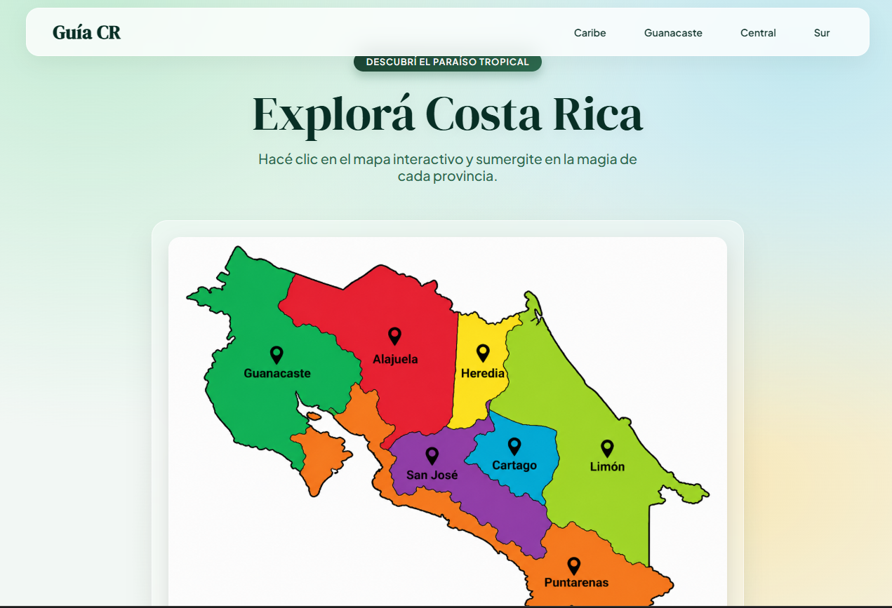
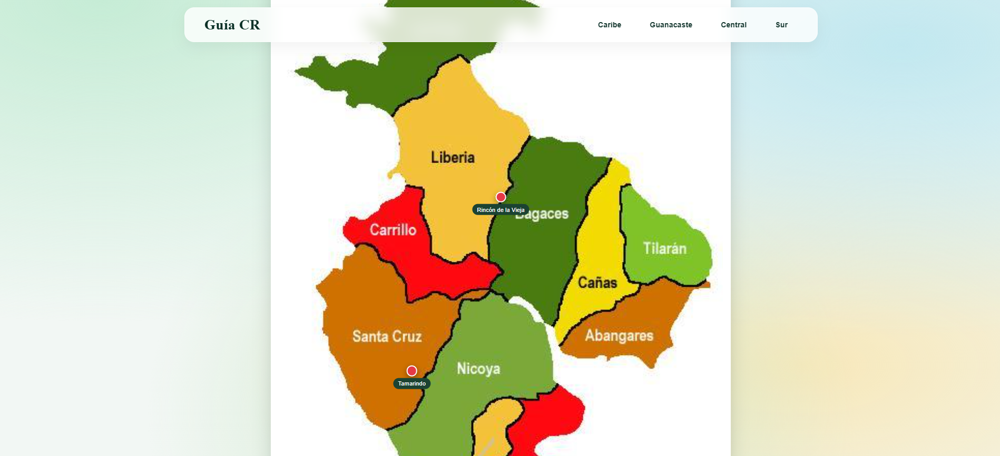
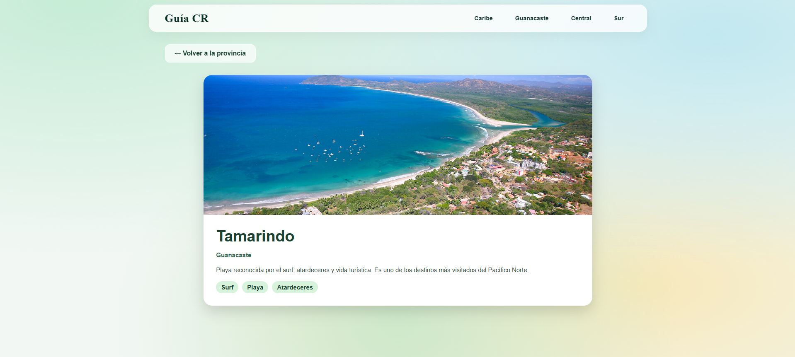

# 🌴 Guía Turística Multimedia de Costa Rica

## 📌 Descripción
Aplicación web interactiva que permite explorar las provincias de Costa Rica y sus destinos turísticos mediante mapas dinámicos, imágenes y contenido multimedia.

## Integrantes
- Umaña Guevara Alexander C27912
- Aguilar Alvarado Esteban C10098
- Rojas Zuñiga Bryan Alonso C16913


---

## 🗺️ Regiones incluidas
- Guanacaste
- Alajuela
- Heredia
- San José
- Cartago
- Limón
- Puntarenas

---

## 📍 Destinos
Se implementan 2 destinos por provincia.
---
## 🌐 Demo del proyecto

Podés ver la aplicación funcionando aquí:

👉 https://alexug0104.github.io/Proyecto_Final_Guia_Turistica/

---

## 🎨 Wireframes / Diseño

### Página principal


### Página de provincia


### Página de destino


---

## 🧩 Web Components

### `<mapa-costa-rica>`
- Muestra el mapa interactivo
- Usa Shadow DOM
- Permite seleccionar provincia

### `<mapa-provincia>`
- Carga mapa de cantones
- Lee datos desde JSON
- Renderiza puntos turísticos

### `<destino-detalle>`
- Muestra información del destino
- Imagen, descripción y actividades

---

## 🎬 Storyboard

1. El usuario ingresa a la página principal.
2. Observa un mapa interactivo de Costa Rica.
3. Selecciona una provincia dando clic sobre el mapa.
4. La aplicación muestra el mapa de cantones de esa provincia.
5. El usuario selecciona uno de los puntos turísticos disponibles.
6. La aplicación muestra la vista de detalle del destino con imagen, descripción y actividades.
---

## ⚙️ Tecnologías utilizadas
1. HTML
2. CSS
3. JavaScript
4. Web Components
5. Shadow DOM
---
## 🧭 Guion de navegación

Página principal  
↓ clic en provincia  
Página de provincia  
↓ clic en punto turístico  
Página de destino  
↓ volver  
Página de provincia / Página principal  

---
## 🎥 Integración multimedia

El proyecto incorpora contenido multimedia en la vista de cada destino turístico.

Cada destino incluye:
- Imagen principal
- Descripción
- Actividades
- Video representativo del lugar

Ejemplo implementado:
- En el destino La Fortuna (Volcán Arenal) se muestra un video de fondo que mejora la experiencia visual del usuario.


## 📦 Estructura JSON

```json
{
  "id": "guanacaste-001",
  "nombre": "Tamarindo",
  "region": "Guanacaste",
  "descripcion": "Playa turística...",
  "imagen_portada": "assents/img/PuntoTamarindo.jpg",
  "galeria": [],
  "audio": "assents/audio/tamarindo.mp3",
  "video": "assents/video/Tamarindo.mp4",
  "actividades": ["Surf", "Playa"],
  "lat": 10.2993,
  "lng": -85.8400,
  "mapTop": 72,
  "mapLeft": 30
}
```

---

## 🚀 Avance Fase 2

- **Custom Elements implementados:** Ya se definieron al menos 4 componentes (`<app-header>`, `<mapa-costa-rica>`, `<mapa-provincia>`, `<destino-detalle>`, `<audio-guia>`).
- **Shadow DOM aplicado:** Todos los Web Components utilizan Shadow DOM para encapsular su estilo y estructura.
- **JSON con más de 3 destinos:** El archivo `destinos.json` contiene la información de más de 10 destinos, todos con su estructura base completa.
- **Audio integrado:** Se integró el componente `<audio-guia>` en la vista de detalle de cada destino, permitiendo la reproducción de audios.
- **Video integrado:** Los videos siguen funcionales y representativos por destino en el fondo de la pantalla.