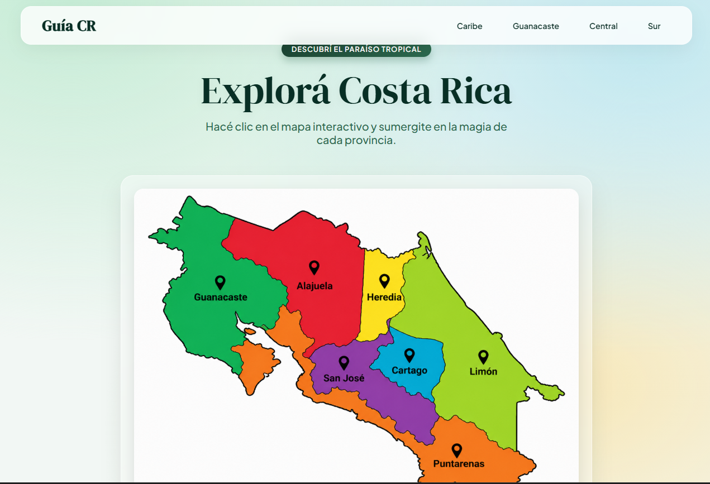
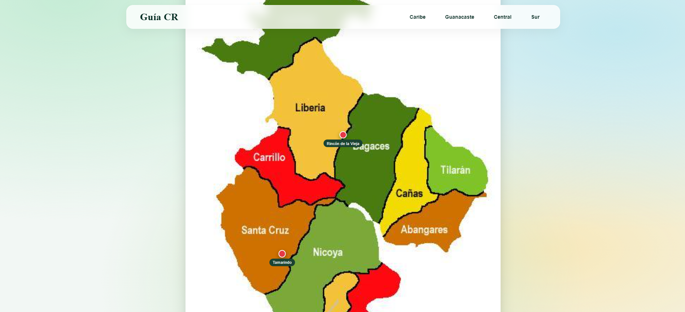
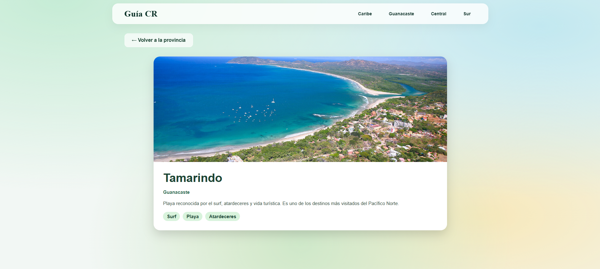

# 🌴 Guía Turística Multimedia de Costa Rica
### 🇨🇷 Proyecto Final - Fase 3 (Entrega Final)

Aplicación web interactiva y responsiva desarrollada con **Web Components nativos (Shadow DOM)** que permite explorar las provincias de Costa Rica y sus riquezas turísticas mediante mapas interactivos, audioguías personalizadas, galerías dinámicas y videos inmersivos en alta definición.

---

## 👥 Integrantes
*   **Umaña Guevara Alexander** - C27912
*   **Aguilar Alvarado Esteban** - C10098
*   **Rojas Zuñiga Bryan Alonso** - C16913

---

## 🌐 Demo en Vivo
Puedes interactuar con la aplicación desplegada en GitHub Pages a través del siguiente enlace:

👉 **[Ver Aplicación en Funcionamiento](https://alexug0104.github.io/Proyecto_Final_Guia_Turistica/)**

---

## 📸 Capturas de Pantalla

Aquí puedes ver el aspecto visual e interactivo de la interfaz:

### 1. Pantalla de Inicio (Mapa de Costa Rica)


### 2. Vista de Provincia (Mapa de Cantones y Destinos)


### 3. Ficha Detallada del Destino (Galería y Audioguía)


---

## 🎯 Requisitos de la Fase 3 Completados al 100%

### 1. Aplicación Totalmente Funcional e Interactiva
*   **Navegación Fluida:** Transición entre la página principal (mapa de Costa Rica), la página de provincias (cantones con pins interactivos y listado de destinos) y la página de destino individual (ficha detallada) a través de parámetros de consulta URL dinámicos.
*   **7 Provincias Implementadas:** Guanacaste, Alajuela, Heredia, San José, Cartago, Limón y Puntarenas.
*   **14 Destinos Turísticos:** 2 destinos completos detallados por provincia en el archivo de base de datos JSON.

### 2. Integración Completa de Medios (Multimedia)
*   **Audioguías Propias (`.mp3`):** Se diseñó un reproductor personalizado `<audio-guia>` que reemplaza los controles genéricos del navegador y reproduce audios históricos/turísticos específicos para los 14 destinos.
*   **Videos Hero (`.mp4`):** Cada página de destino carga dinámicamente en el fondo un video a pantalla completa en bucle y silenciado, integrándose estéticamente con el fondo del sitio a través de difuminados gradientes.
*   **Imágenes de Portada, Galería y Actividades:** Más de 70 imágenes distribuidas en portadas, galerías interactivas ampliables (con Lightbox incorporado) y tarjetas de actividades turísticas recomendadas.
*   **Auditoría de Archivos:** Se validó mediante un script de consola que **todos** los recursos declarados en el JSON existen en el repositorio.

### 3. Componentes Web Implementados (Shadow DOM)
*   `<app-header>`: Barra de navegación con opciones de región rápida, botón de **Destino Sorpresa 🎲** (elige y viaja a un destino al azar) y botón de **Experiencia Mágica ✨** (Dark/Neon Mode con estrellas flotantes persistentes vía `localStorage`).
*   `<mapa-costa-rica>`: Renderiza el mapa principal del país y gestiona la redirección interactiva.
*   `<mapa-provincia>`: Carga el mapa de cantones, posiciona pins interactivos dinámicamente y lista los destinos. En dispositivos móviles incluye lógica especial de doble toque para evitar redirecciones accidentales.
*   `<destino-detalle>`: Renderiza el contenido informativo, el pronóstico del clima local, la galería interactiva de fotos y activa el Lightbox.
*   `<audio-guia>`: Reproductor multimedia personalizado con barra de volumen, barra de progreso interactiva, control de tiempo transcurrido y botón de silenciado.

### 4. Características Estéticas Premium
*   **Glassmorphism:** Uso intensivo de fondos translúcidos, bordes brillantes semi-transparentes y filtros de desenfoque (`backdrop-filter: blur()`).
*   **Micro-animaciones:** Efecto de inclinación en tres dimensiones (3D Tilt effect) en las tarjetas informativas y de actividades según el movimiento del ratón.
*   **Tipografías Elegantes:** DM Serif Display para títulos principales y Plus Jakarta Sans para el cuerpo del texto.

---

## 📂 Estructura del Proyecto
El repositorio está organizado de la siguiente manera:
```
Proyecto_Final_Guia_Turistica/
│
├── index.html                       # Página de Inicio (Mapa de Costa Rica)
├── README.md                        # Documentación Principal del Proyecto
│
├── CapReadme/                       # Capturas de pantalla utilizadas en el README
│   ├── Principal.png
│   ├── GuancaProvincia.png
│   └── Destino.png
│
├── assents/                         # Recursos multimedia y assets (imágenes, audios, videos)
│   ├── audio/                       # 14 pistas de audioguías (.mp3)
│   ├── img/                         # Mapas provinciales y fotos de destinos
│   └── video/                       # 14 videos de fondo en bucle (.mp4)
│
├── components/                      # Lógica de Web Components
│   ├── app-header.js
│   ├── audio-guia.js
│   ├── destino-detalle.js
│   ├── mapa-costa-rica.js
│   └── mapa-provincia.js
│
├── css/                             # Hojas de estilo encapsuladas y globales
│   ├── app-header.css
│   ├── audio-guia.css
│   ├── destino-detalle.css
│   ├── global.css
│   ├── mapa-costa-rica.css
│   └── mapa-provincia.css
│
├── data/                            # Base de datos local
│   └── destinos.json                # Información estructurada de provincias y destinos
│
├── docs/                            # Documentación técnica adicional
│   └── Manual_y_Arquitectura.md     # Manual de usuario y flujo de datos técnicos
│
├── provincia/
│   └── index.html                   # Página intermedia (Mapa de Cantones)
│
└── destino/
    └── index.html                   # Página de detalle (Ficha Multimedia)
```

---

## 🚀 Instalación y Ejecución Local

Debido a que la aplicación realiza solicitudes HTTP locales (`fetch`) para leer el archivo `data/destinos.json` y los componentes web dinámicos, es necesario ejecutarla a través de un servidor local (para evitar restricciones de CORS del navegador).

### Opción 1: Usando Python (Preinstalado en la mayoría de sistemas)
Abre una consola o terminal en la carpeta raíz del proyecto y ejecuta:
```bash
python -m http.server 8000
```
Luego abre tu navegador e ingresa a: http://localhost:8000

### Opción 2: Extensión de VS Code (Live Server)
1. Abre el proyecto en Visual Studio Code.
2. Si no la tienes, instala la extensión **Live Server** de Ritwick Dey.
3. Haz clic derecho en el archivo `index.html` y selecciona **Open with Live Server**.

### Opción 3: Usando Node.js / NPM (Si tienes Node)
Si prefieres usar un servidor rápido de Node, puedes ejecutar:
```bash
npx http-server -p 8000
```
Y acceder a: http://localhost:8000

O alternativamente con `serve`:
```bash
npx serve .
```
Y acceder a: http://localhost:3000

---

## 🛠️ Tecnologías Utilizadas
1.  **HTML5 Semántico:** Estructura limpia y accesible.
2.  **CSS3 Avanzado:** Custom Properties (Variables), Flexbox, CSS Grid y animaciones de keyframes.
3.  **JavaScript Moderno (ES6+):** Programación orientada a objetos para componentes web.
4.  **Web Components:** Custom Elements y Shadow DOM para modularidad de código.
5.  **GitHub Pages:** Alojamiento y despliegue del sitio estático.