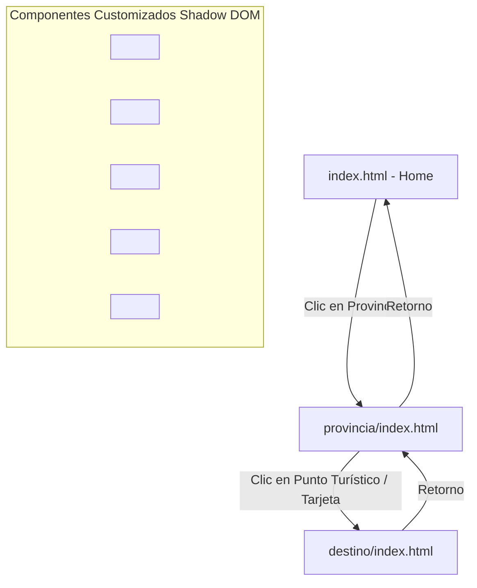

# 📚 Manual de Usuario y Arquitectura Técnica
## Proyecto: Guía Turística Multimedia de Costa Rica (Fase 3 - Entrega Final)

Este documento detalla la arquitectura técnica de la aplicación, el flujo de datos, la estructura del proyecto y provee una guía de uso para usuarios y desarrolladores.

---

## 💻 1. Arquitectura de la Aplicación

La aplicación se diseñó siguiendo el paradigma de **Single Responsibility Principle (Principio de Responsabilidad Única)** aplicada a los **Web Components**, utilizando tecnologías web estándar sin compilación ni dependencias externas (Vanilla HTML/CSS/JS).



### 🧩 2. Catálogo de Web Components (Custom Elements)

Todos los componentes utilizan **Shadow DOM** (`mode: "open"`) para asegurar el encapsulamiento de estilos y comportamiento.

#### A. `<app-header>` (Archivo: `components/app-header.js`)
*   **Propósito:** Proporcionar la barra de navegación global y acceso rápido a regiones del país.
*   **Características Especiales:**
    *   **Destino Sorpresa 🎲:** Elige un destino al azar del archivo JSON y navega directamente a él.
    *   **Experiencia Mágica ✨:** Activa un modo especial (Dark/Neon Mode) que almacena el estado en `localStorage` y genera partículas brillantes interactivas que caen flotando por toda la pantalla de la aplicación.
*   **Estilos:** `css/app-header.css`.

#### B. `<mapa-costa-rica>` (Archivo: `components/mapa-costa-rica.js`)
*   **Propósito:** Renderizar el mapa de Costa Rica interactivo por provincias en la página principal.
*   **Características Especiales:**
    *   Soporte híbrido: Mapa visual con botones posicionados de manera absoluta para pantallas grandes, y cuadrícula de botones móviles con emojis representativos para pantallas táctiles de menor tamaño.
*   **Estilos:** `css/mapa-costa-rica.css`.

#### C. `<mapa-provincia>` (Archivo: `components/mapa-provincia.js`)
*   **Propósito:** Mostrar los cantones de la provincia seleccionada y los puntos turísticos disponibles dentro de ella.
*   **Características Especiales:**
    *   Puntos turísticos interactivos con animación de pulsación infinita (`@keyframes dot-pulse`).
    *   Soporte táctil optimizado: En dispositivos móviles, un primer toque en el pin muestra la etiqueta descriptiva (tooltip), y el segundo toque redirige al detalle, evitando la navegación accidental. En computadoras de escritorio, un solo clic redirige inmediatamente.
    *   Lista de tarjetas con efecto visual Hover 3D para una interfaz premium.
*   **Estilos:** `css/mapa-provincia.css`.

#### D. `<destino-detalle>` (Archivo: `components/destino-detalle.js`)
*   **Propósito:** Desplegar de forma interactiva la información detallada del destino.
*   **Características Especiales:**
    *   **Galería Interactiva:** Permite cambiar la imagen principal al hacer clic en las miniaturas con transiciones suaves de opacidad.
    *   **Efecto Tilt 3D:** Las tarjetas de información y actividades giran en tres dimensiones siguiendo el cursor del ratón (`mousemove`).
    *   **Lightbox Modal:** Zoom a pantalla completa para la imagen principal con fondo oscuro y botón de cierre.
    *   **API Clima Estático:** Provee el pronóstico meteorológico (temperatura, humedad, viento, estado) específico para cada destino.
*   **Estilos:** `css/destino-detalle.css`.

#### E. `<audio-guia>` (Archivo: `components/audio-guia.js`)
*   **Propósito:** Reproductor multimedia personalizado para audios informativos.
*   **Características Especiales:**
    *   Diseño limpio e integrado que reemplaza los controles por defecto del navegador.
    *   Barra de progreso reactiva en tiempo real y soporte para arrastre (*seeking*).
    *   Control de volumen deslizante y silenciado rápido (*mute*).
    *   Manejo robusto del ciclo de vida del audio (reinicio al finalizar, captura de errores de reproducción asíncrona).
*   **Estilos:** `css/audio-guia.css`.

---

## 📊 3. Modelo de Datos y JSON
La información del proyecto se centraliza en `data/destinos.json`. El esquema JSON está optimizado para proveer toda la información multimedia en una sola consulta estructurada:

```json
{
  "id": "String (Identificador único)",
  "nombre": "String (Nombre del destino)",
  "region": "String (Provincia)",
  "descripcion": "String (Descripción del sitio)",
  "imagen_portada": "String (Ruta al archivo de imagen de portada)",
  "galeria": [
    "String (Ruta a imagen 1)",
    "String (Ruta a imagen 2)",
    "String (Ruta a imagen 3)",
    "String (Ruta a imagen 4)"
  ],
  "audio": "String (Ruta a archivo .mp3)",
  "video": "String (Ruta a archivo .mp4 de fondo)",
  "actividades": [
    {
      "nombre": "String (Actividad)",
      "descripcion": "String (Descripción detallada)",
      "imagen": "String (Ruta a la imagen de la actividad)"
    }
  ],
  "direccion": "String (Dirección física)",
  "lat": Float,
  "lng": Float,
  "mapTop": Int (Posicionamiento porcentual Y en mapa),
  "mapLeft": Int (Posicionamiento porcentual X en mapa),
  "mas_informacion": {
    "horario": "String",
    "consejos": "String",
    "mejor_epoca": "String"
  }
}
```

---

## 🗺️ 4. Guía del Usuario (Cómo navegar la aplicación)

1.  **Exploración Inicial (Home):**
    *   Al ingresar verás el título y el mapa principal de Costa Rica.
    *   Coloca el cursor o pulsa en cualquier provincia para ver su nombre iluminado.
    *   Haz clic en una provincia para abrir el mapa detallado.
2.  **Selección de Punto Turístico (Provincia):**
    *   En el mapa de la provincia verás pines circulares amarillos que pulsan.
    *   Pasa el cursor por encima para ver qué destino representa.
    *   Haz clic sobre el pin o en la tarjeta de la lista inferior para ir a la ficha de detalles.
3.  **Visualización de Contenido (Detalle de Destino):**
    *   Al entrar a un destino, el video de fondo se reproducirá automáticamente de manera silenciosa en la cabecera.
    *   **Escuchar la Audioguía:** Haz clic en el botón de reproducción del reproductor multimedia verde.
    *   **Galería:** Haz clic en las fotos inferiores para cambiarlas en la vista principal, o haz clic en la foto de portada para verla a pantalla completa en el Lightbox.
    *   **Ubicación:** Haz clic en el botón "Cómo llegar" para abrir la ubicación exacta directamente en Google Maps.
4.  **Menú Superior:**
    *   Puedes usar los enlaces de regiones en la barra de navegación para cambiar rápido de provincia.
    *   ¿No sabes a dónde ir? Haz clic en **¡Destino Sorpresa! 🎲** y la app elegirá un destino por ti.
    *   ¿Quieres una experiencia única? Activa el botón **Experiencia Mágica ✨** y la web se transformará en un entorno oscuro y brillante con estrellas flotantes.

---

## 🛠️ 5. Guía de Desarrollo (Cómo expandir el proyecto)

### Agregar una Provincia
1.  Obtén la imagen del mapa cantonal y guárdala en `assents/img/<nombre-provincia>/Mapa.png`.
2.  Abre `components/mapa-provincia.js` y añade la ruta de la imagen en la función `obtenerImagenProvincia()` asociándola al nombre exacto de la provincia.
3.  Agrega el botón interactivo en `<mapa-costa-rica>` (dentro de `components/mapa-costa-rica.js`) con su atributo `data-region`.

### Agregar un Destino
1.  Guarda los recursos multimedia en las carpetas correspondientes (`assents/img/`, `assents/audio/`, `assents/video/`).
2.  Abre `data/destinos.json`.
3.  Crea un nuevo objeto JSON al final de la lista siguiendo el esquema establecido.
4.  Calcula los valores `mapTop` y `mapLeft` (entre 0 y 100) para posicionar con exactitud el pin sobre el mapa cantonal de la provincia correspondiente.
