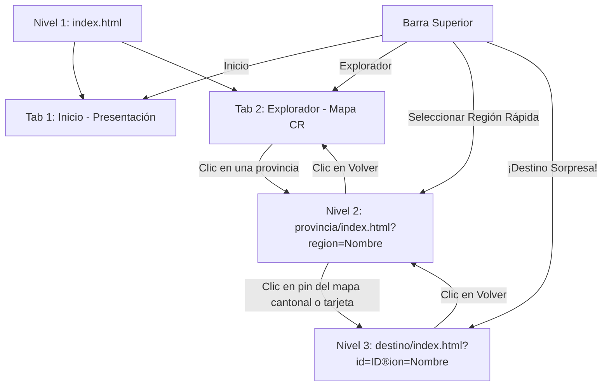

# 🗺️ Documentación de Planificación y Diseño
## Proyecto: Guía Turística Multimedia de Costa Rica (Fase 3 - Entrega Final)

Este documento contiene la planificación inicial, el diseño de la interfaz de usuario y el guión de navegación del proyecto, con el fin de cumplir formalmente con los requerimientos evaluativos de la cátedra (**Planificación y diseño - 20%**).

---

## 🎬 1. Storyboard (Flujo de Experiencia del Usuario)

El siguiente storyboard detalla la secuencia de interacción que realiza un turista al utilizar la aplicación para planificar su viaje:

```
+-----------------------------------------------------------------------------------+
| ESCENA 1: Entrada y Descubrimiento (Página de Inicio)                             |
|                                                                                   |
| El usuario accede a la URL principal. Encuentra una interfaz con estética premium |
| en tonos verde-esmeralda y oro. Lee la introducción y activa el "Modo Mágico ✨"   |
| en la cabecera. La página cambia a un tema oscuro/neón y estrellas flotantes      |
| caen de forma animada. Decide presionar "¡Comenzar a Explorar! 🗺️".             |
+-----------------------------------------------------------------------------------+
                                         |
                                         v
+-----------------------------------------------------------------------------------+
| ESCENA 2: Explorador del País (Mapa Interactivo)                                  |
|                                                                                   |
| La pantalla cambia suavemente a la pestaña del Explorador. El usuario visualiza   |
| un mapa vectorial de Costa Rica dividido en sus 7 provincias. Pasa el cursor      |
| sobre las regiones y nota un cambio visual táctil (efecto hover). Hace clic       |
| en la provincia de "Guanacaste".                                                 |
+-----------------------------------------------------------------------------------+
                                         |
                                         v
+-----------------------------------------------------------------------------------+
| ESCENA 3: Inmersión Provincial (Página de la Provincia)                           |
|                                                                                   |
| Se carga la vista provincial de Guanacaste. Se muestra el mapa detallado con      |
| pines amarillos que pulsan indefinidamente sobre los cantones clave. El usuario   |
| pasa el cursor por encima de un pin y lee "Parque Nacional Rincón de la Vieja".   |
| Hace clic en el pin para abrir los detalles.                                     |
+-----------------------------------------------------------------------------------+
                                         |
                                         v
+-----------------------------------------------------------------------------------+
| ESCENA 4: Ficha Multimedia del Destino (Detalle de Destino)                       |
|                                                                                   |
| Se muestra la ficha técnica del parque nacional. Un video atmosférico en bucle    |
| se reproduce de fondo en la cabecera. El usuario interactúa de la siguiente forma: |
|  1. Escucha la audioguía haciendo clic en el reproductor personalizado.           |
|  2. Visualiza fotos secundarias en la galería interactiva.                        |
|  3. Hace clic en la portada para abrir el visualizador de imágenes (Lightbox).    |
|  4. Consulta el clima estimado local y presiona "Cómo llegar" para abrir Maps.   |
+-----------------------------------------------------------------------------------+
```

---

## 📐 2. Wireframes Estructurales (Bocetos de Diseño)

### A. Página de Inicio (`index.html`)
Diseño de la página principal enfocada en la presentación del proyecto y el acceso al mapa del país.

```
+-----------------------------------------------------------------------------------+
|  Logo: Guía CR               [Inicio]  [Explorador]   |  Caribe  Guanacaste ...    |
+-----------------------------------------------------------------------------------+
|                                                                                   |
|                                🇨🇷 Paraíso Tropical                                 |
|                               EXPLORÁ COSTA RICA                                  |
|                     [ Botón: ¡Comenzar a Explorar! 🗺️ ]                            |
|                                                                                   |
+-----------------------------------------------------------------------------------+
| [ Características del Proyecto ]                                                  |
| +--------------------+  +--------------------+  +--------------------+            |
| | 🗺️ Mapas Locales   |  | 🎧 Audioguías      |  | 🎥 Videos Inmers.  |            |
| +--------------------+  +--------------------+  +--------------------+            |
+-----------------------------------------------------------------------------------+
| [ Costa Rica en Cifras - Estadísticas ]                                           |
|        5% Biodiversidad     |     7 Provincias     |    28 Parques Nac.           |
+-----------------------------------------------------------------------------------+
| Pie de Página: Integrantes & Derechos de Autor                                     |
+-----------------------------------------------------------------------------------+
```

### B. Página de la Provincia (`provincia/index.html`)
Diseño híbrido: Mapa cantonal interactivo y listado de destinos en formato cuadrícula.

```
+-----------------------------------------------------------------------------------+
|  Logo: Guía CR               [Inicio]  [Explorador]   |  Caribe  Guanacaste ...    |
+-----------------------------------------------------------------------------------+
|  <- Volver al mapa principal                                                      |
|                                                                                   |
|                                   GUANACASTE                                      |
|                                                                                   |
|  +-------------------------------------+  +------------------------------------+  |
|  | MAPA DE CANTONES                    |  | LISTADO DE DESTINOS                |  |
|  |                                     |  |                                    |  |
|  |      * [Pin 1: Rincón de la Vieja]  |  | +--------------------------------+ |  |
|  |                                     |  | | Tarjeta Destino 1              | |  |
|  |                  * [Pin 2: Conchal] |  | +--------------------------------+ |  |
|  |                                     |  | | Tarjeta Destino 2              | |  |
|  +-------------------------------------+  +------------------------------------+  |
+-----------------------------------------------------------------------------------+
```

### C. Página de Detalle (`destino/index.html`)
Ficha interactiva del destino con reproducción multimedia y clima.

```
+-----------------------------------------------------------------------------------+
| [ VIDEO HERO EN BUCLE Y SILENCIADO COMO FONDO DE CABECERA (60% alto pantalla) ]    |
|                                                                                   |
|  Logo: Guía CR               [Inicio]  [Explorador]   |  Caribe  Guanacaste ...    |
|  <- Volver a la provincia                                                         |
|                                                                                   |
|  +-----------------------------------------------------------------------------+  |
|  | Portada (Imagen Principal)                                                   |  |
|  | [🔍 Click para pantalla completa - Lightbox]                                |  |
|  +-----------------------------------------------------------------------------+  |
|                                                                                   |
|  TITULO DEL DESTINO                                                               |
|  Provincia/Región                                                                 |
|  Descripción detallada del sitio...                                               |
|                                                                                   |
|  [Etiqueta 1]  [Etiqueta 2]  [Etiqueta 3]                                         |
|                                                                                   |
|  +-----------------------------------------------------------------------------+  |
|  | REPRODUCTOR PERSONALIZADO: <audio-guia>                                     |  |
|  | [▶]  [===== Barra de Progreso =====] 02:15/04:30  [🔊 Slider Volumen]       |  |
|  +-----------------------------------------------------------------------------+  |
|                                                                                   |
|  GALERÍA DE IMÁGENES (Miniaturas clicables)                                       |
|  [Foto 1 (Activa)]  [Foto 2]  [Foto 3]  [Foto 4]                                  |
|                                                                                   |
|  INFORMACIÓN PRÁCTICA                                                             |
|  +------------------+  +------------------+  +---------------------------------+  |
|  | ⏰ Horario       |  | 💡 Consejos      |  | 🌤️ Clima Local                  |  |
|  +------------------+  +------------------+  +---------------------------------+  |
|                                                                                   |
|  ACTIVIDADES RECOMENDADAS (Tarjetas con efecto 3D hover)                          |
|  +-----------------------------------+  +------------------------------------+    |
|  | Actividad 1 (Foto + Texto)        |  | Actividad 2 (Foto + Texto)         |    |
|  +-----------------------------------+  +------------------------------------+    |
|                                                                                   |
|  Ubicación: Dirección física detallada.           [ BOTÓN: Cómo llegar 🗺️ (Maps) ]|
+-----------------------------------------------------------------------------------+
```

---

## 📊 3. Estructura de Datos (JSON Schema)

La base de datos local se aloja en `data/destinos.json` y almacena los campos de manera uniforme. La validez de su formato y la existencia física de los archivos multimedia se comprueba mediante auditorías en el lado del servidor.

```json
{
  "$schema": "http://json-schema.org/draft-07/schema#",
  "title": "Esquema de Destino Turístico",
  "type": "object",
  "required": ["id", "nombre", "region", "descripcion", "imagen_portada", "galeria", "audio", "video", "actividades", "direccion", "lat", "lng", "mapTop", "mapLeft"],
  "properties": {
    "id": { "type": "string", "description": "Identificador único (ej: guanacaste-001)" },
    "nombre": { "type": "string", "description": "Nombre oficial del punto turístico" },
    "region": { "type": "string", "description": "Nombre de la provincia correspondiente" },
    "descripcion": { "type": "string", "description": "Reseña descriptiva del sitio" },
    "imagen_portada": { "type": "string", "description": "Ruta relativa a la imagen de cabecera" },
    "galeria": {
      "type": "array",
      "items": { "type": "string" },
      "description": "Lista de rutas a imágenes secundarias"
    },
    "audio": { "type": "string", "description": "Ruta relativa al audio MP3 de la audioguía" },
    "video": { "type": "string", "description": "Ruta relativa al video MP4 de fondo" },
    "actividades": {
      "type": "array",
      "items": {
        "type": "object",
        "required": ["nombre", "descripcion", "imagen"],
        "properties": {
          "nombre": { "type": "string" },
          "descripcion": { "type": "string" },
          "imagen": { "type": "string" }
        }
      }
    },
    "direccion": { "type": "string", "description": "Texto descriptivo de la ubicación" },
    "lat": { "type": "number", "description": "Latitud geográfica" },
    "lng": { "type": "number", "description": "Longitud geográfica" },
    "mapTop": { "type": "number", "minimum": 0, "maximum": 100, "description": "Porcentaje Y en el mapa" },
    "mapLeft": { "type": "number", "minimum": 0, "maximum": 100, "description": "Porcentaje X en el mapa" },
    "mas_informacion": {
      "type": "object",
      "properties": {
        "horario": { "type": "string" },
        "consejos": { "type": "string" },
        "mejor_epoca": { "type": "string" }
      }
    }
  }
}
```

---

## 🧭 4. Guión de Navegación y Rutas (User Journey)

La arquitectura de la aplicación está dividida en tres niveles de profundidad accesibles por URL parametrizadas:



### Script de navegación por pantalla:
1.  **Paso 1:** El usuario inicia en `index.html?tab=inicio`. Decide explorar y presiona "Comenzar".
2.  **Paso 2:** El estado de la pestaña se actualiza a `index.html?tab=mapa` mediante `history.pushState()`, mostrando el mapa de Costa Rica sin recargar la web.
3.  **Paso 3:** Al hacer clic en un área del mapa (ej. Limón), la ventana redirige a `/provincia/?region=Lim%C3%B3n`.
4.  **Paso 4:** En el mapa provincial de cantones, se cargan dinámicamente los destinos filtrados de Limón. Al pulsar sobre "Canales de Tortuguero", se efectúa la redirección final a `/destino/?id=limon-001&region=Lim%C3%B3n`.
5.  **Paso 5:** En la ficha, el usuario escucha los recursos multimedia y puede usar el enlace superior o el botón de retroceso para volver a la provincia correspondiente de forma fluida.
